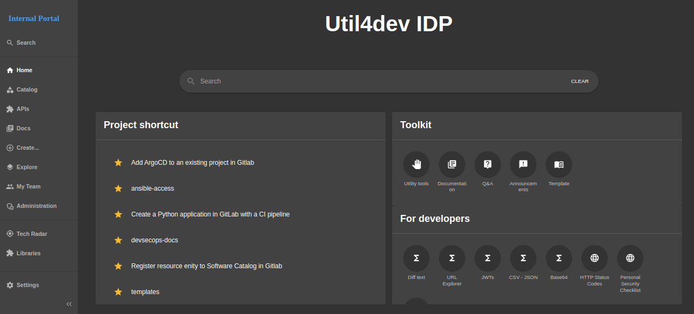

import ReactPlayer from "react-player"

# Tutorial Intro

Let's discover **Util4devops in less than 5 minutes**.

## Demo video

    <ReactPlayer className="video__player" controls height="100%" url="https://youtu.be/n-NhU5ws04I" width="100%" />

## Getting Started

Get started by **Internal Developer Portal Home**.

Or **try Util4devops immediately** with **[idp.util4dev.tech](https://idp.util4dev.tech)**.

### What you'll need

- [Gitlab account](https://gitlab.com/users/sign_in) to sign in to IDP:
  - Before logging in, you are recommended to contact administrator at [devopsplatformengineering\@gmail.com](mailto:devopsplatformengineering@gmail.com?subject=[IDP]Support) for assistance with permissions in IDP

- Or [Github account](https://github.com/login) to sign in to IDP:
  - Before logging in, you are recommended to contact administrator at [devopsplatformengineering\@gmail.com](mailto:devopsplatformengineering@gmail.com?subject=[IDP]Support) for assistance with permissions in IDP

## Login IDP

Access to [idp.util4dev.tech](https://idp.util4dev.tech)

Select the provider you want to authenticate:

#### Login with `Github` provider

#### Login with `GitLab` provider

#### Login with `Self-hosted gitlab` provider

