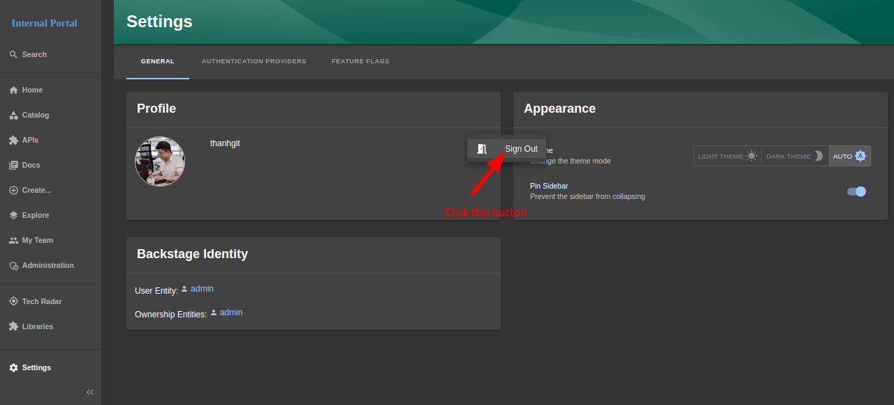

# Create a Account

Create **a account** at others provider:

- `Github` provider, please refer to at https://docs.github.com/en/get-started/start-your-journey/creating-an-account-on-github
- `Github` provider, please refer to at https://about.gitlab.com/get-started/
- `Self-hosted gitlab` provider, please contact your organization to request an account

### Login a account (`github`)

## Login a other provider (`gitlab`)

### `Logout` an account

