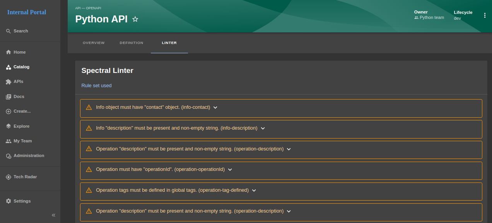

# IDP - API

**API** is part of the service catalog feature in Util4devops IDP 

It is responsible for **API component**

### Create a `catalog-info.yaml` file for API component
- #### Reference documentation: https://backstage.io/docs/features/software-catalog/software-catalog-api/

- #### For example:

```yaml title="catalog-info.yaml"
apiVersion: backstage.io/v1alpha1
kind: API
metadata:
  name: python-api
  title: Python API
  description: |
    A super simple RESTful api created using Flask
  links:
    - title: Repo
      url: https://git.util4dev.shop/apps/python-api
  tags:
    - swagger
    - yaml
spec:
  type: openapi
  system: util4dev
  owner: python-team
  lifecycle: dev
  definition:
    $text: https://gitlab.com/idp4731311/idp-manifests/-/blob/main/apis/python-api-spec.yaml
```

```yaml title="apis/python-api-spec.yaml"
openapi: "3.0.0"
info:
  version: 1.0.0
  title: Swagger Python API
  license:
    name: MIT
servers:
  - url: https://python-api.dev.util4dev.shop
paths:
  /:
    get:
      summary: Get days
      tags:
        - day
      responses:
        '200':
          description: Expected response to a valid request
          content:
            application/json:
              schema:
                type: array
                maxItems: 100
                items:
                  $ref: "#/components/schemas/Day"
        default:
          description: unexpected error
          content:
            application/json:
              schema:
                $ref: "#/components/schemas/Error"
  /{id}:
    get:
      summary: Get day
      tags:
        - day
      parameters:
        - name: id
          in: path
          description: Day ID
          required: true
          schema:
            type: string
      responses:
        '200':
          description: Expected response to a valid request
          content:
            application/json:
              schema:
                type: object
                properties:
                  day:
                    $ref: "#/components/schemas/Day"
        '404':
          description: Not found
        default:
          description: unexpected error
          content:
            application/json:
              schema:
                $ref: "#/components/schemas/Error"
components:
  schemas:
    Day:
      type: object
      properties:
        id:
          type: number
        name:
          type: string
    Error:
      type: object
      required:
        - code
        - message
      properties:
        code:
          type: integer
          format: int32
        message:
          type: string
```

### Create a component for API component 

- #### Access to **[link](/docs/tutorial-basics/idp-service-catalog#create-a-component)**

### View API component


- #### `Step 1:` Click `APIs` button in left sidebar

- #### `Step 2:` Choose a project, then click to it's name to navigate to `API - OPENAPI` - Overview page

    

- #### `Step 3:` click `DEFINITION` to view `Open API Spec`

    

- #### `Step 4:` click `LINTER` to view invalid configuration in `Open API spec`

    