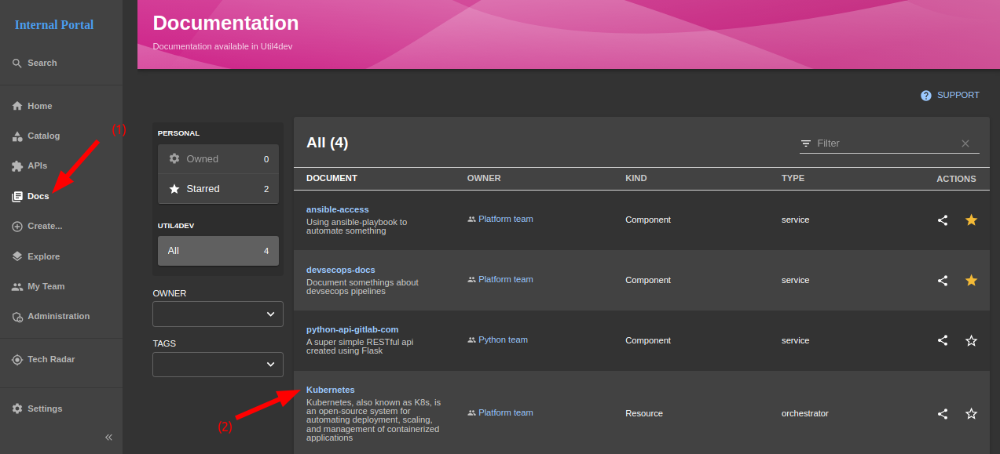
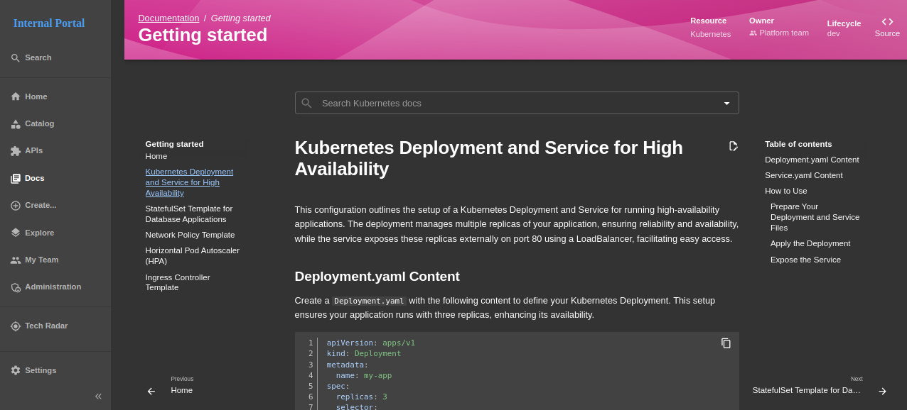
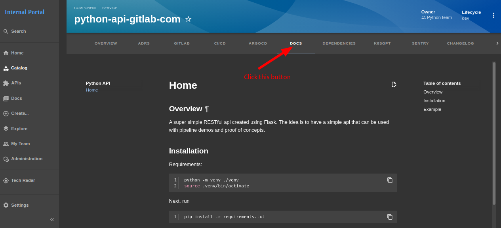

# IDP - Documentation

**Documentation** is part of the **Catalog Component** in Util4devops IDP 

It is responsible for the **documentation** related to the catalog component

#### View documentation



- #### `Step 1:` Click `Docs` button in left sidebar

- #### `Step 2:` Choose a document, then click to it's name to navigate to Documentation page

    

- ### You can view documentation related to service component

    

#### Configure documentation in `catalog-info.yaml` file
- #### Reference documentation: https://backstage.io/docs/features/techdocs/creating-and-publishing/

- ### Get documentation source from local source
    ```yaml title="catalog-info.yaml"
    metadata:
    annotations:
        backstage.io/techdocs-ref: dir:.
    ```