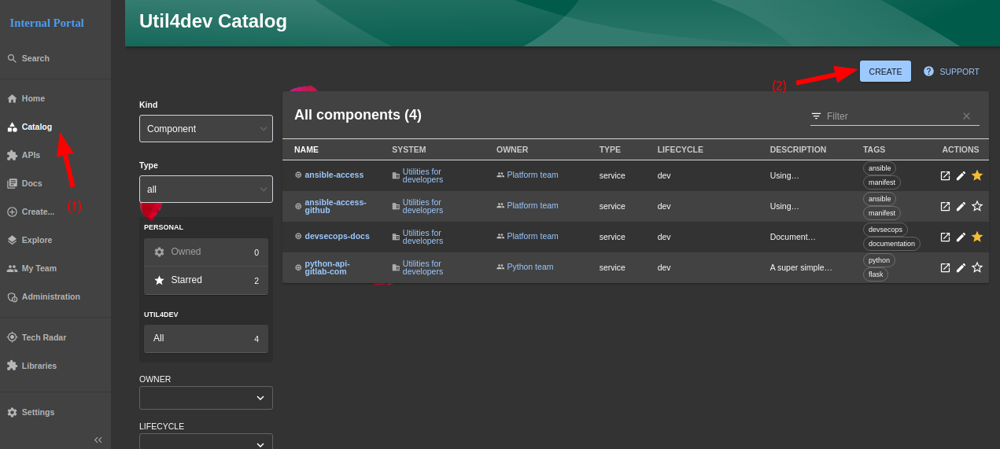
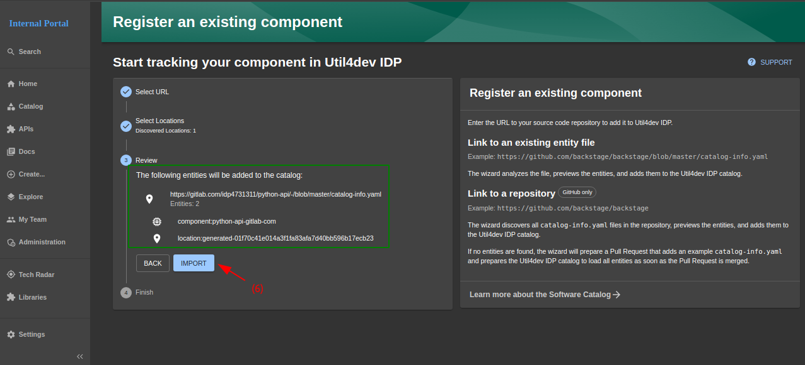
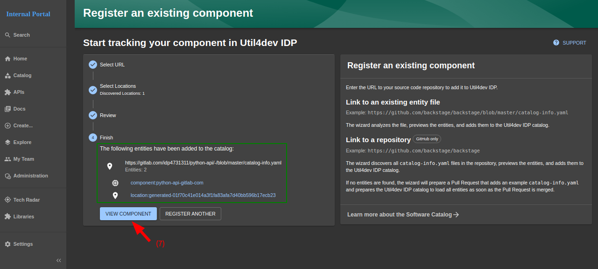

# IDP - Service catalog

Service catalog is a main feature in Util4devops IDP with creating components, APIs, ...

## Create a `catalog-info.yaml`
- #### Reference documentation: https://backstage.io/docs/features/software-catalog/descriptor-format/

- ### For example:
```yaml title="catalog-info.yaml"
apiVersion: backstage.io/v1alpha1
kind: Component
metadata:
  name: "python-api-gitlab-com"
  description: A super simple RESTful api created using Flask
  annotations:
    kong-manager/service-name: backend-service
    kong-manager/instance: /kong-manager/api
    kafka.apache.org/consumer-groups: backstage/demo
    ## changelog plugin
    changelog-file-ref: "url:https://gitlab.com/idp4731311/python-api/-/blob/master/CHANGELOG.md"

    ## techdocs plugin
    backstage.io/techdocs-ref: dir:.

    ## prometheus plugin
    prometheus.io/uptime: 'demo test,git.util4dev.xyz,docker.util4dev.shop'
    prometheus.io/rule: 'monitor_status{monitor_name="python-app.apis.util4dev.shop"}'
    prometheus.io/alert: all

    ## gitlab plugin
    gitlab.com/project-slug: 'idp4731311/python-api'
    gitlab.com/instance: gitlab.com
    gitlab.com/jobs-branches: 'master'

    ## K8sgpt plugin
    backstage.io/kubernetes-label-selector: 'k8sgpts.k8sgpt.ai/namespace=k8sgpt-operator-system'
    k8s.gpt.ai/kubernetes-namespace: 'python-api'

    ## harbor plugin
    goharbor.io/repository-slug: idp4731311/python-api

    ## DORA plugin
    dora.metrics/project-name: 'python-api'

    ## sonarqube plugin
    sonarqube.org/project-key: default/python-api_20

    ## vault plugin
    vault.io/secrets-path: gitlab
    vault.io/secrets-engine: thanhnp # default = secret

    ## argocd plugin
    argocd/app-name: python-api

    ## sentry plugin
    sentry.io/project-slug: python-api

    ## show libaries in requirements.txt
    libraries.io/show: 'true'
    libraries.io/queries: '**/requirements.txt'

    ## show ADR
    backstage.io/adr-location: docs/adrs
  tags:
    - python
    - flask
  links:
    - url: https://gitlab.com/idp4731311/python-api
      title: Git repo
      icon: github
spec:
  target: gitlab.com
  type: service
  owner: group:python-team
  system: util4dev
  lifecycle: dev
  providesApis:
    - python-api
  dependsOn:
    - Resource:argocd
    - Resource:gitlab
    - Resource:harbor
    - Resource:sonarqube
    - Resource:vault
```

## Create a component
- #### Reference documentation: https://backstage.io/docs/features/software-catalog/ 

  

- #### `Step 1:` Click `Catalog` button in left sidebar

- #### `Step 2:` Click `Create` button to navigate to `Create a new component` page

  

- #### `Step 3:`click `REGISTER EXISTING COMPONENT` to navigate to `Register an existing component` page

  

- #### `Step 4:` entering `catalog-info.yaml` file. For example: https://gitlab.com/idp4731311/python-api/-/blob/master/catalog-info.yaml

- #### `Step 5:` click `ANALYZE` to continue

  

- #### `Step 6:` view catalog-info, then click `IMPORT` to continue

  

- #### `Step 7.1:` click `VIEW COMPONENT` to native to component page

  

- #### `Step 7.2:` click `REGISTER ANOTHER` to navigate to continue import new catalog-info ~ back to `Step 4`