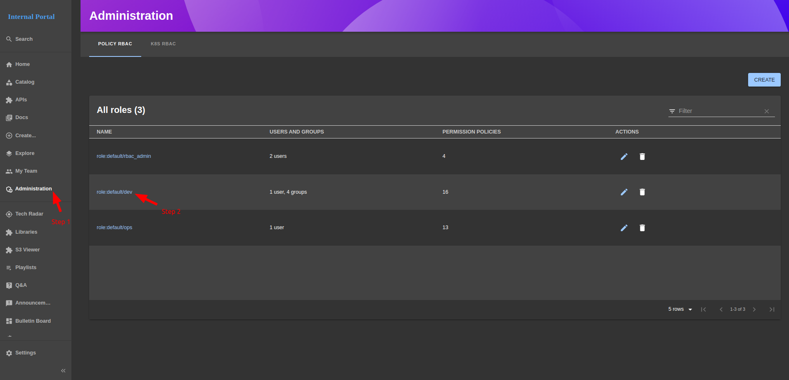
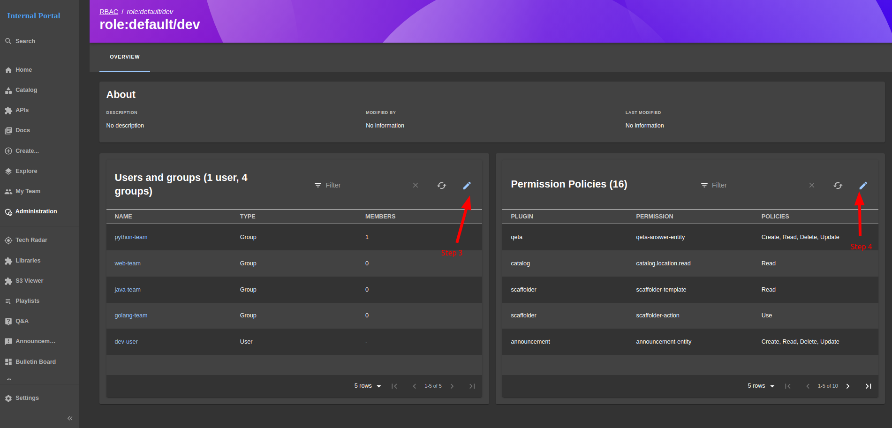
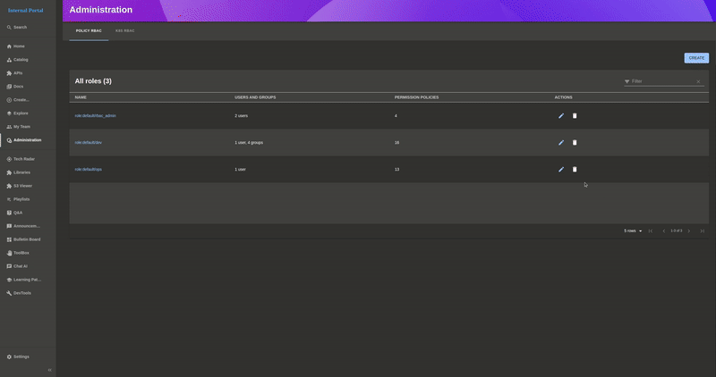

# IDP - Administration

This page contains Policy RBAC, K8S RBAC URL

### View Policy RBAC

- #### Step 1: Click `Administration` to navigate to Administration page

- #### Step 2: click on any role name to navigate to details about that role, for example: `role:default/dev`

    

- #### Step 3: click `Pen icon` to update users and groups attached to the role

    

- #### Step 4: click `Pen icon` to update Permission Policies attached to the role

    

### Create a new Policy RBAC

### Delete a Policy RBAC

