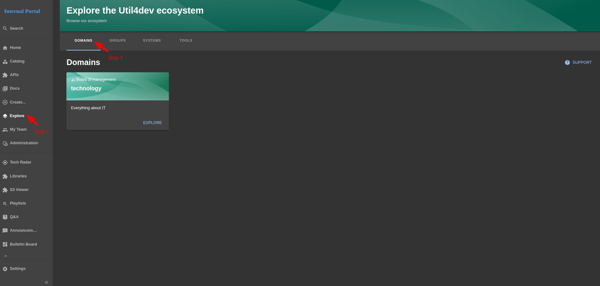
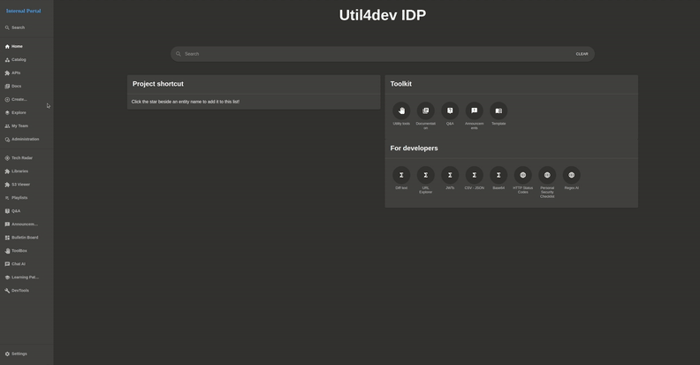
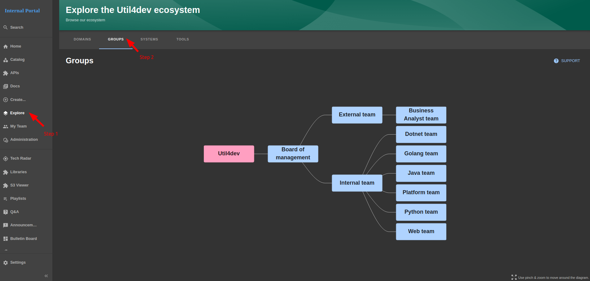
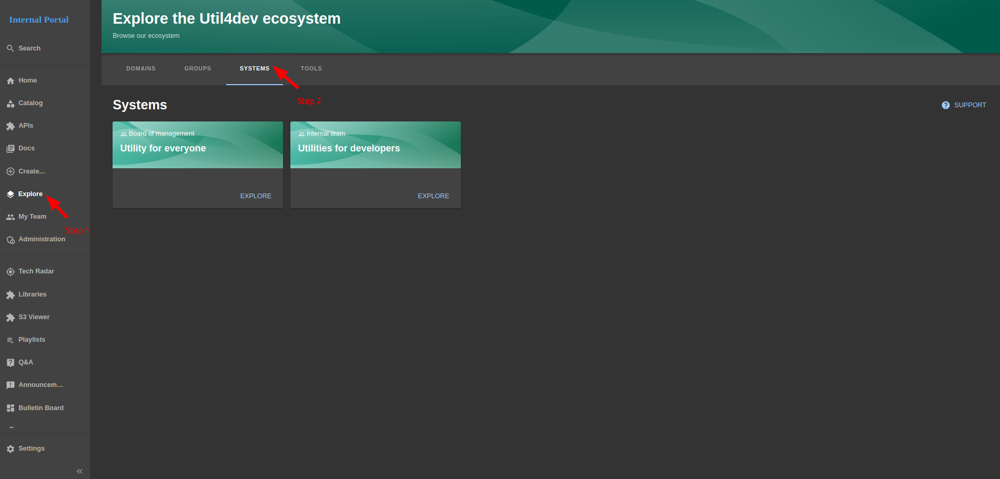

# IDP - Explore

This page explore your structural organization such as

- **Domains** of projects such as Payments, Core Banking, Card, ...
- **Groups** is whom, 

### `Domain`
- #### Documentation reference: https://backstage.io/docs/features/software-catalog/system-model/#domain

- #### `Overview domain page`

  

- #### `How to access domain page`

  

### `Groups`
- ### Documentation reference: https://backstage.io/docs/features/software-catalog/system-model/#group

- #### `Overview group page`

  

- #### `How to access group page`

  

### `Systems`
- ### Documentation reference: https://backstage.io/docs/features/software-catalog/system-model/#system

- #### `Overview system page`

  

- #### `How to access specific system entity` (util4dev)

  

### `Tools`
- ### **Some tools** used in your organization

- #### `Overview tool page`

  

- #### `How to access specific tool` (argoCD)

  