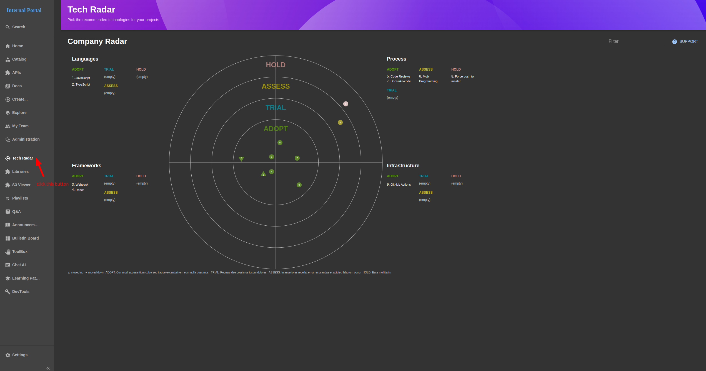

# IDP - Utility feature

This page helps you explore utility features like my-team, playlists, utility functions

### `View your team information`

  

### `View technical stack radar`

  

### `View specific technical stack`

  

- #### `Step 1`: click `Playlists` button to navigate to Technical stacks page

- #### `Step 2`: click `CHOOSE` at any box to navigate to specifc technical stack like `python technical stack`

  

  

### `Use helper functions`